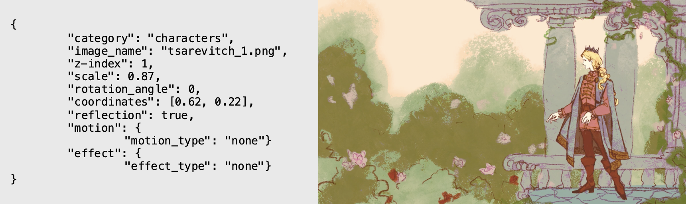

# Digital puppet theater

[Читать на русском](README.ru.md)

An application for automatically generating animations based on a scenario specified in JSON format. The program receives image source files, font files, and a JSON file as input; the script is processed and outputs a cartoon stylized as a theatrical performance.

The project is implemented in Python using the OpenCV, Pillow, and MoviePy libraries.

List of automated actions:

1. Image selection and preprocessing, which involves removing simple backgrounds using the Sobel operator and morphological operations.
2. Image transformation: scaling, rotation, and mirroring.
3. Positioning the object image in the scene.
4. Object movement with specified parameters.
5. Applying effects to the object image.
6. Creating a scene clip.
7. Applying selected effects to the scene clip.
8. Creating scene subtitles.
9. Compiling scenes into a final video and saving it.

For research purposes, a custom function was also implemented that calculates a gradient based on the Sobel operator with 3x3 kernels.

## Installation

```bash
git clone https://github.com/aniglovilui/doll-theatre.git
cd doll-theatre
pip install -r requirements.txt
```

## Input Data

All image sources are manually uploaded by the user to the **sources/** folder in the project root.

### 1. Image Sources

Character images are added to the **sources/images/characters/** subfolder, item images to **sources/images/props/**, and background images to **sources/images/backgrounds/**.

### 2. Font sources

The .ttf font files should be located in the **sources/fonts/** folder.

### 3. JSON script files

The script files are placed in the **scenarios/** folder in the project root.

## Launch

```bash
python3 main.py
```

To demonstrate the program's operation, enter `scenario_test` in the console after `Enter file name without extension:` output. The file **scenario_test.json** contains the first two scenes of the demo cartoon. The full demo cartoon can be recreated by entering `happieness_in_a_box` as the file name and found with the same name in **performances/**.

For more convenient compilation of the cartoon, you can use test mode. Test mode is selected by entering "y" to the question `Enable test mode? [y/n]:`. This mode allows you to select specific scenes to render, as well as time limits for them to verify the composition.

## Scenario JSON Template

### Structure

The scenario has the following multi-level structure (data is included for clarity). A detailed description and purpose of each field can be found below in the [Field Description](#field-description) section.

```JSON
{
    "scenario_name": "Scenario Name",
    "movie_sizes": [1280, 720],
    "main_font": {
        "font_name": "font-name.ttf",
        "font_size": 36,
        "font_color": "#ffffff",
        "stroke_color": "#000000",
        "stroke_width": 2
    },
    "accent_font": {
        "font_name": " font-name.ttf",
        "font_size": 36,
        "font_color": "#aabbcc",
        "stroke_color": "#000000",
        "stroke_width": 2
    },
    "scenes": [
        {
            "index": 1,
            "description": "Scene description.",
            "duration": 7.0,
            "background": "background.png",
            "lines": [
                {
                    "character": "Character name",
                    "text": "Some text.",
                    "font": {
                        "font_size": 120,
                        "font_color": "#ebc354",
                        "stroke_color": "#1a100b",
                        "stroke_width": 2
                    },
                    "appearing_time": 0.0,
                    "time": 5.3,
                },
                {...}
            ],
            "composition": [
                {
                    "category": "characters",
                    "image_name": "character1.png",
                    "z-index": 1,
                    "scale": 1.1,
                    "rotation_angle": 0,
                    "coordinates": [0.51, 0.13],
                    "reflection": false,
                    "opacity": 0.5,
                    "motion": {
                        "motion_type": "linear",
                        "starting_time": 3.2,
                        "motion_time": 4.1,
                        "params": {
                            "speed": [0, 10]
                        }
                    },
                    "effect": [
                        {
                        "effect_type": "appearance",
                        "effect_appearance_time": 3.2,
                        "effect_duration": 1.0
                        },
                        {...}
                    ]
                },
                {...}
            ],
            "scene_effect": [
                {
                    "effect_type": "scene_fade_out",
                    "effect_appearance_time": 5.3,
                    "effect_duration": 1.0,
                    "fade_color": [0, 0, 0]
                }
            ]
        },
        {...}
    ]
}

```

### Field Description

#### Global Parameters

- `scenario_name` (string) – Defines the name of the scenario.
- `movie_sizes` (list) – Output video dimensions in pixels, written in the [width, height] format.

**Text Styles**

Font styles are standardized through the `main_font` objects, used to style the author's or narrator's lines, and the `accent_font`, used by default for all other character lines. Separating the main and accent fonts allows for different styles for the main text and accent elements, reducing duplication in scene descriptions. Both parameters are optional: if they are missing, or if any of their fields are missing, default values ​​are used to determine the missing properties.

Each font object includes the following properties:

- `font_name` (string) – TrueType font file name.
- `font_size` (int) – Font size.
- `font_color` (srting) – Text color in HEX.
- `stroke_color` (string) – Text outline color in HEX.
- `stroke_width` (int) – Outline width.

#### Scenes List

This is an list of objects, each describing a single scene in the cartoon, with each scene being an independent block. A scene is characterized by the following parameters:

- `index` (int) – Scene index in the script.
- `description` (string, optional) – Text description of the scene for the author's convenience.
- `duration` (float) – Total scene duration in seconds.
- `background` (string) – File name of the background image for the scene.

The visual and temporal content of a scene is divided into two semantic blocks: the `lines` list, which describes the text lines in the scene, and the `composition` (list).
The `lines` list is an array of objects with the following parameters:

- `character` (string) – The name of the character speaking the line.
- `text` (string) – The text of the line.
- `font` (object, optional) – The local text style for the line. Allows you to override the global `main_font` or `accent_font` or their individual fields for a specific line, and therefore contains the same fields (`font_size`, `font_color`, etc.). Missing fields are inherited from the global style.
- `appearing_time` (float, optional) – The time a line appears on screen relative to the scene start, in seconds. This field can be omitted; if omitted, it is automatically calculated based on the appearance time and duration of the previous line. If this parameter is omitted, all lines in the scene will appear one after another, starting at time 0.0.
- `time` (float) – The time a line appears on screen relative to the appearance time, in seconds.

The list of visual elements used in the `composition` scene is an array of objects with the following parameters:

- `category` (string) – The element's category. The value can be one of the following: `"characters"`, `"props"`.
- `image_name` (string) – The element's image filename.
- `z-index` (int) – The layer level. Determines the drawing order, where elements with a higher value are drawn on top.
- `scale` (float, optional) – The scale of the element. A value of 1.0 corresponds to a scale of 100%. The default is 100%.
- `rotation_angle` (float, optional) – The rotation angle of the element in degrees. The default is 0.
- `coordinates` (list) – Element position coordinates relative to the video dimensions in the format [x, y], where [0.0, 0.0] corresponds to the upper-left corner of the background image, and [1.0, 1.0] corresponds to the lower-right corner. This allows for independent positioning of elements for different video dimensions. Optionally, you can specify coordinates in pixels instead of relative ones.
- `reflection` (boolean, optional) – Flag indicating whether the element is horizontally mirrored. By default, no reflection is displayed.
- `opacity` (float, optional) – Element opacity. The value ranges from 0 to 1. By default, the element is fully opaque, which corresponds to a value of 1.
- `motion` (object, optional) – An object describing the element's movement animation. If this parameter is omitted, the motion is not implemented. This will be described in more detail later.
- `effect` (object, optional) – An array of objects describing the effects applied to the element (appearance, disappearance, etc.). If this parameter is omitted, the effects are not implemented. This will be described in more detail later.

The dynamics of elements are described in the `motion` object, whose objects have the following properties:

- `motion_type` (string) – Motion type. If there is no motion, it can be specified as "none".
- `starting_time` (float, optional) – The start time of the motion relative to the scene start, in seconds. The default value is 0.0, which represents the start of the scene.
- `motion_time` (float, optional) – The duration of the motion, in seconds. If this parameter is omitted, the motion continues until the end of the scene.
- `start` (list, optional) – The coordinates of the start of the motion. These are usually not specified, as by default, the motion starts from the element's positioning coordinates, which are a required parameter.
- `params` (object) – Motion parameters. The structure depends on the desired type of motion. To implement rotation around the object's center, the `angle_speed` parameter is required: the angular velocity vector omega, measured in degrees per second. For uniformly accelerated linear motion, the `speed` parameter is the linear velocity vector [vx, vy] in pixels per second. For accelerated motion (parabolic trajectory), the `speed` parameter can be omitted or combined with the `acceleration` parameter, which represents the acceleration vector [ax, ay]. A combination of all three parameters is possible, in which case the object will move along a parabolic trajectory with rotation around the center. The `stop` parameter can be specified, containing the coordinates of the end of the motion. In this case, the motion is automatically considered uniformly accelerated linear, and the velocity components are calculated as the quotient of the displacement along the corresponding axis and the time of the motion.

The element's effects are described in the `effect` array. Effects are applied to the object's image in the order they appear in the array. Each effect has the following properties:

- `effect_type` (string) – Effect type. One of the following options: `"appearance"`, `"disappearance"`, `"none"`, corresponding to the fade-in and fade-out of an object in the scene image. If set to "none", the effect is not applied.
- `effect_appearance_time` (float, optional) – Effect start time, in seconds, relative to the scene start. By default, it starts at 0.0.
- `effect_duration` (float, optional) – Effect duration, in seconds. By default, it is 0.5 seconds.

The general scene effects in the `scene_effect` array are applied to the entire frame, in the order they appear in the array. The `scene_effect` field is a property of the `scene` object. An example of a scene effect is a fade-out with specified color and timing parameters.

The scene effect parameters are similar to the element effect parameters (`effect_type`, `effect_appearance_time`, `effect_duration`), except that they require the `fade_color` parameter (list) – the fade-in or fade-out color in the [R, G, B] format. The `effect_type` parameter must have one of the values ​​`"scene_fade_in"`, `"scene_fade_out"`, `"scene_flash"`. When specifying `"scene_fade_in"`, it is possible to also add the `in_the_op` (bool) field with the value True, which signals the need to begin the scene with a lightening from the specified color. When specifying `"scene_fade_out"`, it is possible to add the `in_the_end` (bool) field with the value True, which signals the need to end the scene with a darkening to the specified color. When specifying `"scene_flash"` (bool) with a value of True, the effect occurs in the middle of the scene and appears as a flash, which is a sequential combination of a darkening effect to the selected color and lightening from it.

### Example of an object description in JSON format and its interpretation in a scene



## Sources

- The implementation of the background removal algorithm is based on the article:
  [Простой фильтр для автоматического удаления фона с изображений](https://habr.com/ru/articles/353890/) by [ArXen42](https://habr.com/ru/users/ArXen42/).
